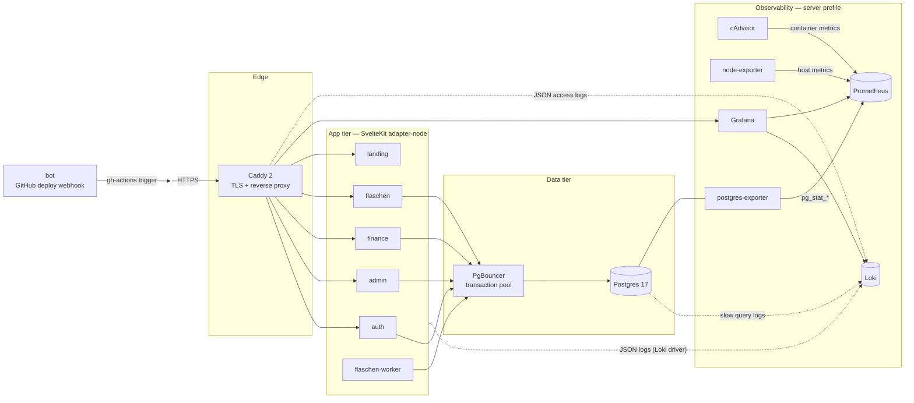
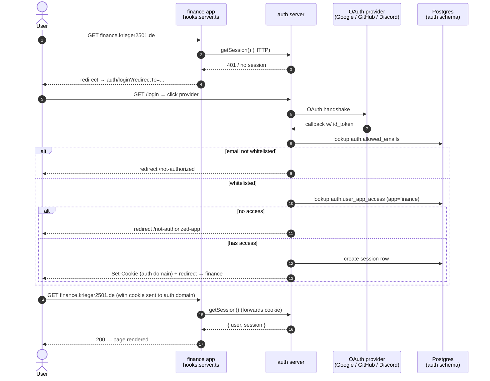
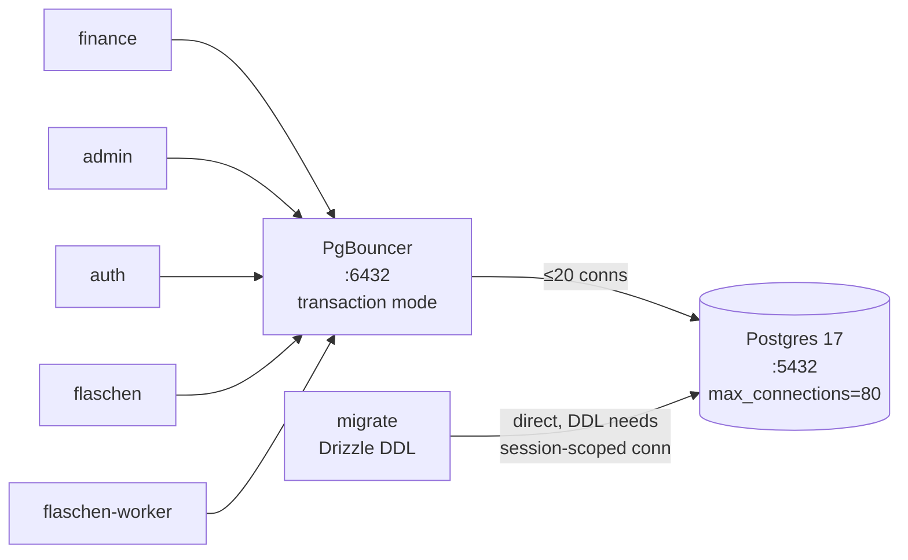
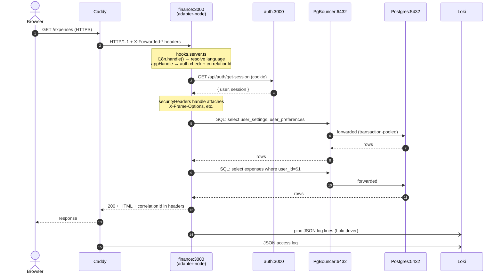
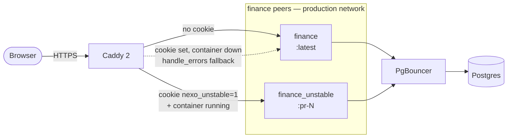
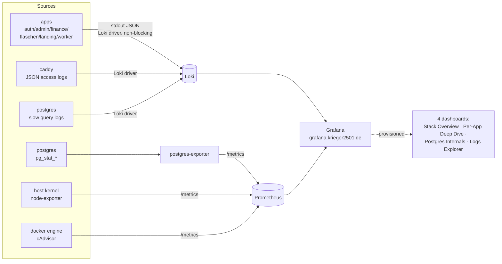

# Architecture

## Overview

Nexo is a monorepo of independent SvelteKit apps that share a single PostgreSQL database and a central auth service. Each app is a self-contained PWA deployable as a home screen icon on iOS.

```
nexo/
├── apps/
│   ├── auth/        → auth.krieger2501.de   — OIDC provider, login UI
│   ├── admin/       → admin.krieger2501.de  — Container management, user access
│   ├── finance/     → finance.krieger2501.de — Personal finance tracker
│   ├── flaschen/    → flaschen.krieger2501.de — Flaschenpost shift-offer notifier (web + worker)
│   ├── landing/     → krieger2501.de         — App directory + /apps route
│   └── bot/         → internal               — GitHub webhook bot (deploy automation)
└── packages/
    ├── db/          → Drizzle schemas + migration runner
    ├── errors/      → Error codes + i18n user messages
    ├── logger/      → Structured JSON logging (pino) with correlation IDs
    ├── i18n/        → Language detection utilities, Language type
    ├── push/        → Web Push (VAPID, subscriptions, send helpers, SW handlers)
    └── email/       → Email templates (React Email)
```

### System map

Everything runs as Docker Compose services on a single 8 GB / 6-vCore VPS, fronted by Caddy.



---

## Authentication flow

All user-facing apps delegate authentication to the central auth server via OAuth 2.0 / OIDC. The auth server is the only service that knows about passwords or OAuth provider credentials.



The session cookie is set on the **auth domain**, not the app domain. Each app validates the session by calling the auth server on every request — there is no JWT passed between apps.

---

## Database layout

One PostgreSQL instance, one database (`nexo`), namespaced by Postgres schema:

```
nexo (database)
├── auth (schema)
│   ├── user                — one row per user (Better Auth managed)
│   ├── session             — active sessions (Better Auth managed)
│   ├── account             — OAuth provider links (Better Auth managed)
│   ├── verification        — email verification tokens (Better Auth managed)
│   ├── oauth_application   — OIDC client registrations
│   ├── oauth_access_token  — issued OIDC tokens
│   ├── oauth_consent       — user consent records
│   ├── allowed_emails      — email whitelist; controls who can sign in
│   ├── user_app_access     — per-user, per-app access control (active)
│   └── user_preferences    — global prefs: language, theme, birthday
├── finance (schema)
│   ├── accounts            — bank/cash accounts
│   ├── expenses            — recurring and one-off expenses
│   ├── income              — recurring and one-off income
│   ├── debts               — money owed to/from others
│   └── user_settings       — per-user finance prefs (currency, display name, week start)
├── flaschen (schema)
│   ├── account             — Flaschenpost account link, encrypted refresh/access tokens
│   ├── prefs               — user filter rules (days, time window, warehouse, workgroup, reward score)
│   ├── seen_offer          — dedup table for offers the worker has observed (per user × dedupeKey)
│   ├── seen_location       — discovered warehouse/workgroup labels for the settings UI
│   └── poll_log            — per-poll outcome log (offers seen, matches, errors)
└── push (schema)
    └── subscription        — Web Push subscriptions (per user × app × endpoint)
```

Every app-schema table has a `user_id TEXT` foreign key referencing `auth.user.id`. This means every query is automatically scoped to the authenticated user.

**All schemas are defined in `packages/db/schema/`** and consumed by every app as a workspace dependency (`@nexo/db`).

### Connection pooling

Apps don't connect to Postgres directly. **PgBouncer** sits in front in transaction-pooling mode and absorbs reconnect storms (e.g. when 5 apps restart at once on deploy). Postgres caps at `max_connections=80`; PgBouncer fans out to up to `MAX_CLIENT_CONN=200` short-lived client connections sharing a `DEFAULT_POOL_SIZE=20` pool per (db, user).



The migration runner deliberately bypasses PgBouncer (DDL doesn't survive transaction-pooled rebinding). It uses `MIGRATE_DATABASE_URL` pointing at `postgres:5432`; everything else uses `DATABASE_URL` pointing at `pgbouncer:6432`. Per-app pool caps in `packages/db/src/index.ts`: web apps `max: 8`, the flaschen worker `max: 5` — keeps total backend RAM bounded.

Postgres-js uses prepared statements by default; PgBouncer 1.21+ supports them in transaction mode and we set `MAX_PREPARED_STATEMENTS=100` to enable it.

---

## Monorepo structure

```
nexo/
├── .env                        ← secrets (gitignored)
├── .env.local                  ← local overrides (localhost DATABASE_URL for Drizzle CLI)
├── .env.example                ← template, committed
├── docker-compose.yml          ← all service definitions (production, server, unstable profiles)
├── docker-compose.override.yml ← local dev overrides (swaps https URLs for localhost)
├── Caddyfile                   ← reverse proxy + TLS config
├── knip.config.ts              ← workspace-aware dead-code config
├── turbo.json                  ← task pipeline (build order, caching)
├── pnpm-workspace.yaml         ← workspace package globs
├── vite.shared.ts              ← shared Vite config (merged by all apps)
├── package.json                ← root scripts, shared dev deps
├── tsconfig.json               ← base TS config (extended by all packages)
├── grafana/                    ← Grafana provisioning (datasources, dashboards JSON)
├── loki/                       ← Loki config (local-config.yaml)
├── prometheus/                 ← Prometheus config + custom postgres-exporter queries
├── apps/
│   └── <app>/
│       ├── src/
│       │   ├── app.html
│       │   ├── app.css          ← design tokens (@theme for Tailwind v4)
│       │   ├── app.d.ts         ← App.Locals, App.PageData types
│       │   ├── hooks.server.ts  ← auth guard + security headers + i18n
│       │   ├── lib/
│       │   │   ├── server/      ← server-only code (never imported by .svelte files)
│       │   │   ├── components/
│       │   │   ├── paraglide/   ← generated i18n message functions
│       │   │   └── i18n.ts      ← Paraglide i18n configuration
│       │   └── routes/
│       │       ├── +layout.server.ts  ← session + shared data load
│       │       ├── +layout.svelte
│       │       ├── auth/callback/+server.ts  ← OIDC callback handler
│       │       └── [feature]/
│       │           ├── +page.server.ts
│       │           └── +page.svelte
│       ├── project.inlang/     ← Paraglide project config
│       ├── messages/           ← i18n message files (en.json, de.json, tr.json)
│       ├── svelte.config.js    ← adapter-node, Svelte compiler options
│       ├── vite.config.ts      ← Vite + PWA + Paraglide plugin config
│       ├── eslint.config.js
│       ├── Dockerfile
│       └── package.json
├── packages/
│   ├── db/
│   │   ├── schema/
│   │   │   ├── auth.ts
│   │   │   └── finance.ts
│   │   ├── src/
│   │   │   ├── index.ts        ← Drizzle client + all schema exports
│   │   │   └── migrate.ts      ← migration runner (used by Docker)
│   │   ├── drizzle.config.ts
│   │   └── package.json
│   ├── errors/
│   │   └── src/index.ts        ← error codes + i18n userMessage(code, lang)
│   ├── logger/
│   │   └── src/index.ts        ← pino logger factory with correlation ID support
│   ├── i18n/
│   │   └── src/index.ts        ← Language type, detectLanguage() from headers
│   └── email/
│       ├── src/                ← React Email templates
│       └── package.json
├── tools/
│   └── cli/                    ← @nexo/cli — build/promote/deploy orchestrator (`pnpm exec nexo …`)
├── scripts/
│   └── deploy.mjs              ← VPS-side deploy: snapshot, compose pull/up, healthcheck, rollback
└── .github/
    ├── actions/
    │   ├── setup/              ← composite: pnpm + node + frozen install
    │   └── build-and-push/     ← composite: GHCR login, buildx, `nexo ci`
    └── workflows/
        ├── ci.yml              ← quality + build/retag + release-please + promote + deploy
        ├── unstable.yml        ← bot-dispatched up/down for `_unstable` peer services
        ├── ghcr-cleanup.yml    ← prune old image tags
        └── pr-cleanup.yml      ← drop `:pr-<n>` tags when PRs close
```

---

## Request lifecycle (finance app example)



---

## Per-service unstable deployments

When a maintainer ticks a service in a PR's sticky bot comment, the `nexo-bot`
dispatches `unstable.yml`, which brings up an `_unstable` peer container running
the PR's `:pr-<n>` image alongside production. Production users see no change —
Caddy routes them to the stable container by default. Anyone with the
`nexo_unstable=1` cookie set on `.krieger2501.de` (set via the toggle in each
app's About card or manually via devtools) is routed to the unstable container
instead. If that container isn't running (no PR is currently up, or the
unstable container is unhealthy), `handle_errors` in Caddy silently falls back
to stable so the cookie can never produce a 502.



Each response carries `X-Nexo-Routed-To: stable | unstable | stable-fallback`,
captured by Caddy's JSON access log → Loki. The `stable-fallback` value is a
canary signal that an unstable container is unhealthy.

The compose stack defines a `_unstable` peer for each pinnable app
(`auth`, `admin`, `finance`, `flaschen`, `landing`) on the `unstable` profile.
Image tags are parametrised: `image: ghcr.io/nexo-suite/nexo-finance:${FINANCE_UNSTABLE_TAG:-latest}`,
read from `.env.unstable` on the VPS (gitignored, bot-managed). The bot writes
this file when starting an unstable container and clears it on PR close or after
a successful production release. Production therefore always converges to a
known-good `:latest` state.

All bot mutations (slash commands, checkbox toggles) are gated by a GitHub
repo-permission check — only `admin`/`maintain`/`write` collaborators can drive
the bot.

---

## Observability

The stack is fully self-hosted. Logs flow through Loki, metrics through Prometheus, both visualised in Grafana.



Each request gets a correlation ID (`x-correlation-id` header) that propagates through all log lines for that request. Error responses include the correlation ID so users can report it for debugging.

**Logs (Loki).** Apps emit structured JSON via `@nexo/logger` (pino). Postgres logs slow queries (`log_min_duration_statement=500`) directly into Loki. Caddy emits JSON access logs with `request_host`, `status`, `duration`. Loki retention is 30 days; ingester capped (`ingestion_rate_mb=4`, `max_streams_per_user=1000`).

**Metrics (Prometheus).** Three exporters scrape on a 15s interval:

- `cadvisor` → per-container CPU / memory / network / I/O
- `node-exporter` → host CPU, RAM, disk, swap, sockets
- `postgres-exporter` → `pg_stat_database`, `pg_stat_statements` (top queries by mean exec time), `pg_database_size`

**Grafana dashboards** are provisioned from `grafana/provisioning/dashboards/json/` so they version with the repo:

| Dashboard              | Use case                                                                                                           |
| ---------------------- | ------------------------------------------------------------------------------------------------------------------ |
| **Stack Overview**     | At-a-glance: container count, host RAM/disk/swap, PG connections, log/error rates by service                       |
| **Per-App Deep Dive**  | `$app` template var → memory vs limit, CPU%, Caddy request rate by status class, p50/p95/p99 latency, error counts |
| **Postgres Internals** | Cache hit ratio, connections, DB size, commits/sec, tuple rates, top queries by mean exec time, slow query log     |
| **Logs Explorer**      | `service` × `level` × free-text contains; total/error stats, log rate, raw log panel                               |

The admin app's Services panel surfaces a curated subset (container health + log tail) for non-Grafana users.

---

## Production runtime: budget & tuning

The VPS is 8 GB / 6 vCore. The compose file pins **mem_limit / mem_reservation / cpu_shares / oom_score_adj** on every production service so one runaway can't starve the others.

| Service         | mem_limit | cpu_shares | oom_score_adj | Notes                                             |
| --------------- | --------- | ---------- | ------------- | ------------------------------------------------- |
| postgres        | 2 g       | 2048       | -800          | shared_buffers=512MB, jit=off, pg_stat_statements |
| finance         | 768 m     | 2048       | -500          | most users → highest weight                       |
| admin           | 512 m     | 1024       | -200          | mounts docker.sock; not read-only                 |
| flaschen        | 512 m     | 1024       | -200          |                                                   |
| flaschen-worker | 256 m     | 512        | 0             |                                                   |
| auth            | 256 m     | 512        | -100          |                                                   |
| landing         | 192 m     | 256        | 0             |                                                   |
| caddy           | 192 m     | 1024       | -300          | edge                                              |
| loki            | 384 m     | 512        | +200          | killed first under pressure                       |
| grafana         | 192 m     | 256        | +200          | killed first under pressure                       |
| pgbouncer       | 64 m      | 512        | -300          |                                                   |
| bot             | 192 m     | 256        | 0             |                                                   |

`cpu_shares` are _relative_ weights (default 1024) — idle CPU still flows freely; finance just wins under contention. `oom_score_adj` tells the kernel which container to kill last (Postgres, finance, caddy) and which to kill first (loki, grafana) when memory pressure hits.

**Hardening.** Every Node app runs `read_only: true` with `tmpfs:/tmp:size=64M` (admin opted out — it needs the docker socket). All services use `pull_policy: always`. Postgres, Loki, Grafana, migrate use `json-file` log driver with rotation (`max-size=10m`, `max-file=3`); other services ship logs through the Loki driver and never touch local disk.

**Postgres tuning** (passed via `command:` in compose):

```
shared_buffers=512MB           effective_cache_size=1536MB
work_mem=16MB                  maintenance_work_mem=128MB
max_connections=80             random_page_cost=1.1
effective_io_concurrency=200   jit=off
shared_preload_libraries=pg_stat_statements
track_io_timing=on             log_min_duration_statement=500
shm_size: 256mb
```

`jit=off` is a real OLTP win (JIT overhead exceeds speedup at small query sizes). VPS-side: 4 GB swap, `vm.swappiness=10`, `net.core.somaxconn=4096`, daemon-wide `live-restore: true` so containers survive `dockerd` restarts.

---

## Internationalization

Each SvelteKit app uses [Paraglide.js](https://inlang.com/m/gerre34r/library-inlang-paraglideJs) for compile-time i18n. Messages are defined per-app in `messages/{en,de,tr}.json` and compiled to type-safe functions (`m.key()`).

Language resolution priority:

1. User's `language` field in `auth.user_preferences` (if not `'auto'`)
2. `Accept-Language` header → best match via `@nexo/i18n` detectLanguage()
3. Fallback: `'en'`

Supported languages: English, Deutsch, Türkçe.

---

## Tech decisions

**Why one monorepo instead of separate repos?**
Shared Drizzle schema is the killer reason. When you rename a column in `finance.ts`, the TypeScript error shows up immediately in the app. With separate repos you'd need to publish an npm package, bump a version, and update a dependency — for a personal project that's pure friction.

**Why not one big SvelteKit app?**
Each PWA needs its own `manifest.json` with its own name, icon, and theme color so iOS treats them as distinct home screen apps. A single app at one domain can only have one manifest.

**Why Better Auth as an OIDC provider instead of Authentik/Keycloak?**
Authentik and Keycloak are enterprise SSO servers that run as separate heavyweight services. Better Auth runs inside your existing SvelteKit app, uses your existing database, and is configured in TypeScript. For 10 users it's the right level of complexity.

**Why Caddy instead of Nginx?**
Caddy provisions and renews Let's Encrypt certificates automatically. With Nginx you'd also need Certbot and cron jobs. The Caddyfile for this project is 10 lines.

**Why Paraglide instead of i18next / svelte-i18n?**
Paraglide compiles messages to tree-shakeable functions at build time — no runtime bundle, no loading states, full type safety. For a small app with 3 languages it's the lightest option.

**Why PgBouncer in front of Postgres?**
Five Node apps × `postgres-js` default `max:10` is up to 50 idle backends, each pinning ~10 MB in Postgres. PgBouncer in transaction mode lets us cap real backends to a small `DEFAULT_POOL_SIZE=20` while apps still see fast-to-acquire connections, and it absorbs reconnect storms when the whole stack restarts on deploy. The migration runner deliberately bypasses it (DDL needs a session-scoped connection) via a separate `MIGRATE_DATABASE_URL`.

**Why pino + Loki instead of Datadog / Sentry?**
For a personal project on a €5/mo VPS, a fully self-hosted log stack (pino → stdout → Loki → Grafana) costs nothing extra and gives full-text search over structured logs. Sentry would be overkill for 10 users.

**Why thin Dockerfiles + `@nexo/cli` orchestration?**
The runner already runs `pnpm install && pnpm build` for the quality gate. Re-running it inside a Buildx container per app is pure duplication. Instead, `nexo prepare-contexts` runs `pnpm --prod --legacy deploy out/<app>` once per app, producing a self-contained directory; the Dockerfile is a single-stage `COPY . . + CMD`. Workflow YAML stays declarative — no matrix loops, no inline retag bash, no per-app conditionals. The CLI in `tools/cli/` decides between full build and registry-side retag based on event metadata.
