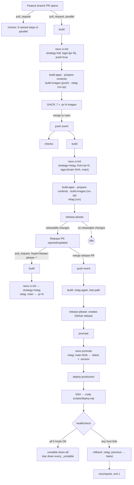
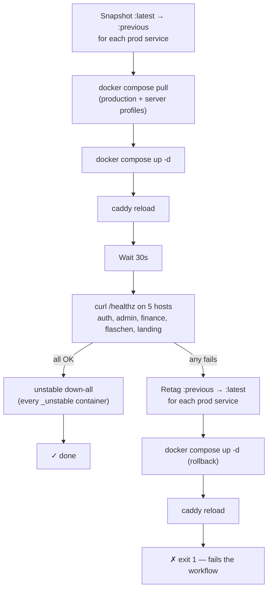
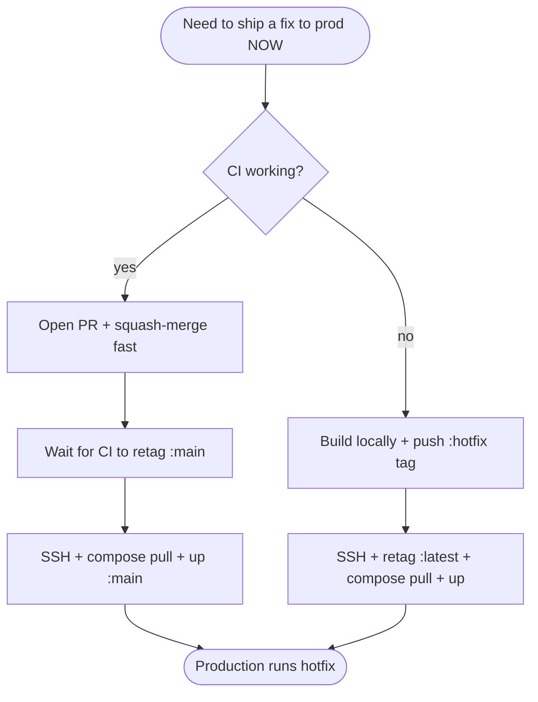
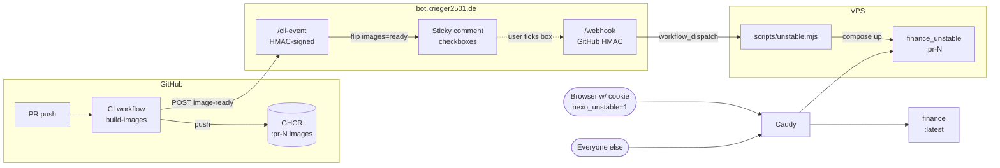

# Deployment

## Infrastructure

- **VPS:** IONOS L+ (6 vCore, 8 GB RAM, 240 GB NVMe SSD)
- **OS:** Ubuntu 24.04 LTS
- **Domain:** `krieger2501.de` (and `*.krieger2501.de` subdomains)
- **Stack:** Docker Compose, Caddy (auto TLS), PostgreSQL 17, Loki + Grafana

---

## Initial server setup (one-time)

SSH in as root:

```bash
# Create a non-root user
adduser nexo
usermod -aG sudo nexo

# Harden SSH — paste your public key first
mkdir -p /home/nexo/.ssh
cat >> /home/nexo/.ssh/authorized_keys << 'EOF'
ssh-ed25519 AAAA... your-public-key
EOF
chmod 700 /home/nexo/.ssh
chmod 600 /home/nexo/.ssh/authorized_keys
chown -R nexo:nexo /home/nexo/.ssh

# Disable root login and password auth
nano /etc/ssh/sshd_config
# Set: PermitRootLogin no
# Set: PasswordAuthentication no
systemctl restart ssh

# Firewall
ufw allow OpenSSH
ufw allow 80/tcp
ufw allow 443/tcp
ufw enable
ufw status

# Switch to the new user for everything below
su - nexo
```

---

## Install Docker

```bash
curl -fsSL https://get.docker.com | sh
sudo usermod -aG docker $USER
newgrp docker
docker -v   # verify
```

---

## Point DNS

In the IONOS domain control panel, add A records for each subdomain:

| Hostname                 | Type | Value      |
| ------------------------ | ---- | ---------- |
| `krieger2501.de`         | A    | `<VPS IP>` |
| `auth.krieger2501.de`    | A    | `<VPS IP>` |
| `finance.krieger2501.de` | A    | `<VPS IP>` |
| `admin.krieger2501.de`   | A    | `<VPS IP>` |
| `grafana.krieger2501.de` | A    | `<VPS IP>` |

Wait for propagation before continuing (5–30 min). Verify:

```bash
dig +short auth.krieger2501.de   # should return your VPS IP
```

Caddy will fail to obtain TLS certificates if DNS isn't pointing at the server yet.

---

## Update OAuth redirect URIs

In each provider's developer console, **add** the production URI alongside the localhost one you added during development. Do not remove the localhost entries.

| Provider | Production redirect URI                                 |
| -------- | ------------------------------------------------------- |
| Google   | `https://auth.krieger2501.de/api/auth/callback/google`  |
| GitHub   | `https://auth.krieger2501.de/api/auth/callback/github`  |
| Discord  | `https://auth.krieger2501.de/api/auth/callback/discord` |

OAuth credentials are only registered against the **auth** app — admin and finance authenticate through the auth server, so no additional redirect URIs are needed for them.

---

## Clone and configure

```bash
cd ~
git clone https://github.com/nexo-suite/nexo
cd nexo
cp .env.example .env
nano .env
```

Generate strong secrets:

```bash
openssl rand -hex 32   # for BETTER_AUTH_SECRET
```

Fill in `.env`:

```bash
POSTGRES_PASSWORD=<strong password>
DATABASE_URL=postgres://nexo:<POSTGRES_PASSWORD>@postgres:5432/nexo
BETTER_AUTH_SECRET=<openssl output>
GOOGLE_CLIENT_ID=...
GOOGLE_CLIENT_SECRET=...
GITHUB_CLIENT_ID=...
GITHUB_CLIENT_SECRET=...
DISCORD_CLIENT_ID=...
DISCORD_CLIENT_SECRET=...

# Web Push (any app that sends notifications — e.g. flaschen)
# Generate with: pnpm exec web-push generate-vapid-keys
VAPID_PUBLIC_KEY=...
VAPID_PRIVATE_KEY=...
VAPID_SUBJECT=mailto:admin@krieger2501.de

# Flaschen — Schichtangebot notifier
# Generate with: openssl rand -base64 32
FLASCHEN_TOKEN_ENC_KEY=...
FLASCHEN_OAUTH_CLIENT_ID=86fe707f-ea47-4bf3-aa81-42579bf180cd
```

> Public URLs (`PUBLIC_AUTH_URL`, `PUBLIC_FLASCHEN_URL`, etc.) are **not** in `.env` — they're hardcoded as literals in `docker-compose.yml` because they're stable per environment and not secret. Only secrets go in `.env`.

---

## Deploy

### CI/CD pipeline

The pipeline lives in `.github/workflows/ci.yml`. Heavy lifting is done by the `@nexo/cli` workspace package (`tools/cli/`, invoked as `pnpm exec nexo …`) and `scripts/deploy.mjs`. The workflow file is a flat list of named steps — no composite actions, no inline retag bash.

**Core principle:** every code change is built **exactly once**, on its first PR. Every later transition (PR → main → release PR → release) is a registry-side `imagetools` retag (~5s), not a rebuild.

**Decision is data, not control flow.** The first build step runs `nexo ci-init`, which inspects the GitHub event and writes `.nexo/ci-context.json` — a frozen snapshot of `{event, sha, prNumber, sourcePrNumber, isReleasePleasePr, strategy, tags, fromTag, push, gitCommit, buildTime}`. Subsequent commands (`build-apps`, `prepare-contexts`, `build-images`, `retag`) read that file and self-skip when their stage doesn't apply, so the YAML body has zero `if:` conditionals on application logic.



### What happens at each stage

#### 1. Feature branch PR opens — `pull_request` event

| Job                | Steps                                                                                                                                                                                                         |
| ------------------ | ------------------------------------------------------------------------------------------------------------------------------------------------------------------------------------------------------------- |
| `checks`           | `pnpm package:check` → `format:check` → `sync` → `translate` → `build:packages` → `knip` → `lint` → `type:check` → `test`. Each is its own collapsible Actions step.                                          |
| `build` (parallel) | `nexo ci-init` (strategy=`full`, tags=`[pr-<n>]`, push=`true`) → GHCR login → buildx → `build-apps` → `prepare-contexts` (`pnpm deploy --prod` per app) → `build-images --push` → `retag` (no-op for `full`). |

**Result:** 7 fresh `:pr-<n>` images in `ghcr.io/nexo-suite/nexo-*`.

#### 2. PR merges to `main` — `push` event

| Job              | Action                                                                                                                                                                                                                                                                       |
| ---------------- | ---------------------------------------------------------------------------------------------------------------------------------------------------------------------------------------------------------------------------------------------------------------------------- |
| `checks`         | Re-runs against the merge commit                                                                                                                                                                                                                                             |
| `build`          | `nexo ci-init` looks up the source PR via `gh api /commits/<sha>/pulls`. If found → strategy=`retag`, from=`pr-<n>`, tags=`[main-<sha>, main]`. The four pipeline steps then run unchanged: `build-apps`/`prepare-contexts`/`build-images` self-skip, `retag` does the work. |
| `release-please` | If conventional-commit changes accumulated since last release → opens or updates a release PR titled `chore(main): release …`. **No release happens yet.**                                                                                                                   |

**Result:** `:main-<sha>` + `:main` exist; release PR may be pending.

#### 3. release-please PR opens — `pull_request` event

The release PR is a normal PR, so it triggers the same `pull_request` workflow:

| Job      | Action                                                                                                                                                                                                                                 |
| -------- | -------------------------------------------------------------------------------------------------------------------------------------------------------------------------------------------------------------------------------------- |
| `checks` | Runs against the version-bumped state                                                                                                                                                                                                  |
| `build`  | `nexo ci-init` detects head ref `release-please--*` → strategy=`retag`, from=`main`, tags=`[pr-<n>]`. `retag` does the work; the build/prepare/build-images steps self-skip. The release PR's `:pr-<n>` images mirror current `:main`. |

#### 4. Release PR merges — `push` event again, but with releases

| Job                 | Action                                                                                                                                                                                                                                                                      |
| ------------------- | --------------------------------------------------------------------------------------------------------------------------------------------------------------------------------------------------------------------------------------------------------------------------- |
| `build`             | Retag `:pr-<n>` → `:main-<sha>` + `:main` (same fast-path as step 2)                                                                                                                                                                                                        |
| `release-please`    | Now creates GitHub releases (`releases_created=true`), pushes per-app tags. The `collect-versions` step runs `pnpm exec nexo collect-versions` which reads `$RP_OUTPUTS_JSON` and emits `{"auth":"0.6.0","admin":"…","finance":"…","flaschen":"…","landing":"…","bot":"…"}` |
| `promote`           | `pnpm exec nexo promote` reads `RELEASE_VERSIONS_JSON` + `GITHUB_SHA`, retags `:main-<sha>` → `:latest` + `:<version>` per app via `imagetools create`                                                                                                                      |
| `deploy-production` | SSH to VPS → `git fetch && reset --hard origin/main` → `node scripts/deploy.mjs`                                                                                                                                                                                            |

### The build-job context (`nexo ci-init`)

`nexo ci-init` is the only build-job step that reads the GitHub event environment. It writes `.nexo/ci-context.json` once, and emits two values to `$GITHUB_OUTPUT` for the workflow itself:

| Output                       | Used by                                  |
| ---------------------------- | ---------------------------------------- |
| `steps.ctx.outputs.strategy` | _(reference only — not currently gated)_ |
| `steps.ctx.outputs.push`     | `if:` on the GHCR login step             |

Every other CLI command (`build-apps`, `prepare-contexts`, `build-images`, `retag`) reads the context file directly and self-skips when its stage doesn't apply. The pipeline stays the same flat sequence regardless of strategy:

```yaml
- name: Build apps
  run: pnpm exec nexo build-apps # no-op on retag

- name: Prepare deploy contexts
  run: pnpm exec nexo prepare-contexts # no-op on retag

- name: Build & push container images
  run: pnpm exec nexo build-images # no-op on retag

- name: Retag images
  run: pnpm exec nexo retag # no-op on full
```

### Deploy script (`scripts/deploy.mjs`)

Runs on the VPS, invoked over SSH. Zero deps (uses `node:child_process` only). Versions arrive as env vars passed via `appleboy/ssh-action`'s `envs:` field.



### Mental model

| Event             | Build action                                                       | Cost                    |
| ----------------- | ------------------------------------------------------------------ | ----------------------- |
| Feature PR        | Full build, tag `:pr-<n>`                                          | 1× build (the only one) |
| Merge to main     | Retag `:pr-<n>` → `:main-<sha>` + `:main`                          | ~5s                     |
| release-please PR | Retag `:main` → `:pr-<n>`                                          | ~5s                     |
| Release merge     | Retag again, then `:main-<sha>` → `:latest` + `:<version>`, deploy | ~5s + SSH deploy        |

Monitor pipeline runs in the [Actions tab](https://github.com/nexo-suite/nexo/actions).

### Manual deployment (emergency / first-time)

SSH into the VPS and run directly:

```bash
cd ~/nexo
git pull origin main
docker compose -f docker-compose.yml --profile production --profile server --env-file .env pull
docker compose -f docker-compose.yml --profile production --profile server --env-file .env up -d
docker compose -f docker-compose.yml exec caddy caddy reload --config /etc/caddy/Caddyfile
```

Monitor startup:

```bash
docker compose logs -f              # all services
docker compose logs -f caddy        # watch for TLS cert issuance
docker compose logs -f migrate      # confirm migrations ran
docker compose ps                   # check all services are Up
```

---

## Migrating an existing prod to PgBouncer (one-time)

Background: production used to connect apps directly to `postgres:5432`. After [introducing PgBouncer + `pg_stat_statements`](#) the topology is:

- Apps → `pgbouncer:5432` (transaction-pooled, ~20 real backends serving up to 200 client conns).
- Migrate runner → `postgres:5432` directly. DDL doesn't survive transaction-pooled rebinding, so it has to bypass the pooler.
- Postgres loads `pg_stat_statements` via `shared_preload_libraries`, but the actual extension object is per-database and has to be created with SQL.

**Note on the port.** edoburu's pgBouncer image rebinds the listener to 5432 (canonical default is 6432) so apps don't need a different DSN port to drop the pooler in. If you've worked with vanilla pgBouncer you may have it muscle-memorized as 6432 — here it's 5432.

### Step 1 — update `.env` on the VPS, _before_ the deploy lands

```bash
ssh nexo@<vps>
cd ~/nexo
nano .env
```

Two changes:

```diff
- DATABASE_URL=postgres://nexo:<password>@postgres:5432/nexo
+ DATABASE_URL=postgres://nexo:<password>@pgbouncer:5432/nexo
+ MIGRATE_DATABASE_URL=postgres://nexo:<password>@postgres:5432/nexo
```

Why both vars: compose wires migrate via `${MIGRATE_DATABASE_URL:-${DATABASE_URL}}`. If `MIGRATE_DATABASE_URL` is unset, migrate silently goes through pgBouncer and DDL breaks.

### Step 2 — let CI ship it

Merge → release-please → `deploy-production`. The deploy script runs `compose up -d`, which:

- Recreates `postgres` because its `command:` args changed (`shared_preload_libraries=pg_stat_statements` is new).
- Brings up the new `pgbouncer` service.
- Re-creates app containers; they now resolve `DATABASE_URL` to `pgbouncer:5432`.

Healthcheck in `deploy.mjs` should pass — the app images don't know or care that they're hitting a pooler.

### Step 3 — create the extension and bounce the exporter (post-deploy)

`shared_preload_libraries=pg_stat_statements` only loads the library; the extension object is per-database and has to be created explicitly. Until it exists, `postgres-exporter` will spam errors against its `pg_stat_statements` query in `prometheus/postgres-queries.yaml`.

```bash
# Confirm postgres came up with the new flag
docker compose exec postgres psql -U nexo -d nexo \
  -c "SHOW shared_preload_libraries;"
# expected: pg_stat_statements

# Create the extension (idempotent)
docker compose exec postgres psql -U nexo -d nexo \
  -c "CREATE EXTENSION IF NOT EXISTS pg_stat_statements;"

# Verify
docker compose exec postgres psql -U nexo -d nexo \
  -c "SELECT extname, extversion FROM pg_extension WHERE extname = 'pg_stat_statements';"

# Restart postgres-exporter so it stops logging "relation does not exist"
# and starts scraping cleanly. This is the post-deploy "re-up" step.
docker compose --profile production --profile server restart postgres-exporter
```

### Sanity checks

```bash
# pgBouncer is pooling
docker compose exec pgbouncer psql -h 127.0.0.1 -p 5432 -U nexo -d pgbouncer -c "SHOW POOLS;"

# pg_stat_statements is collecting
docker compose exec postgres psql -U nexo -d nexo \
  -c "SELECT count(*) FROM pg_stat_statements;"

# All apps healthy via pgBouncer
for h in auth admin finance flaschen krieger2501.de; do
  curl -fsS "https://${h}/healthz" >/dev/null && echo "✓ $h" || echo "✗ $h"
done
```

### Rollback

The deploy script auto-rolls images on healthcheck failure, but the `.env` change is yours:

```bash
# Revert the DSN
sed -i 's/@pgbouncer:5432/@postgres:5432/' .env
# (you can leave MIGRATE_DATABASE_URL — it just becomes redundant)

# Re-up apps to pick up the reverted DSN
docker compose --profile production up -d --force-recreate auth admin finance flaschen landing bot
```

Postgres + pgBouncer can stay running during a rollback — apps just bypass the pooler via the reverted `DATABASE_URL`.

---

## Seed your email

```bash
docker compose exec postgres psql -U nexo -d nexo \
  -c "INSERT INTO auth.allowed_emails (email) VALUES ('your@email.com');"
```

Open `https://auth.krieger2501.de/login` and sign in. That's your admin account.

---

## Hotfix without a full release

The normal path is CI/CD — merge to main and let release-please handle it (see Deploy above).



### CI working: pin a single service to `:main`

If you need to ship a fix to production **without** waiting for a release PR but CI is healthy:

1. Merge the fix to `main`. CI retags `:pr-<n>` → `:main-<sha>` + `:main`.
2. SSH to the VPS and pin a single service to `:main`:
   ```bash
   cd ~/nexo
   git pull origin main
   # Pull the :main tag for the service you need to update
   docker compose --profile production --env-file .env pull finance
   docker compose --profile production --env-file .env up -d finance
   ```

The `:latest` images for other services stay untouched. Next release will fold the fix in normally.

> Don't `--build` on the VPS. The Dockerfiles are thin (single-stage `COPY . . + CMD`); the actual build happens in CI inside `pnpm deploy` output. Building locally would fail because the VPS doesn't have the source tree's `node_modules/` or `build/` artifacts.

### Worst case: CI is broken / can't ship through release-please

When CI itself is unavailable (provider outage, broken workflow, etc.) and you must ship a fix immediately, bypass CI entirely: build locally, push to GHCR, retag `:latest`, and roll the service on the VPS by hand.

**Prerequisites on your laptop:** Docker (with buildx), `docker login ghcr.io` (or `gh auth login` and `gh auth token | docker login ghcr.io -u <username> --password-stdin`), SSH access to the VPS as `deploy`.

```bash
# 1. Build and push a hotfix-tagged image. The :hotfix-<sha> tag can't collide
#    with normal CI output, so it's safe even if CI comes back mid-flight.
SHORT_SHA=$(git rev-parse --short HEAD)
APP=finance   # or whichever broken service
IMAGE="ghcr.io/nexo-suite/nexo-$APP:hotfix-$SHORT_SHA"

# Build context the same way CI does
pnpm install --frozen-lockfile
pnpm exec nexo build-apps
pnpm exec nexo prepare-contexts

# Push with the same Dockerfile CI uses
docker buildx build \
  -f "out/$APP/Dockerfile" \
  -t "$IMAGE" \
  --push \
  "out/$APP"

# 2. Retag :latest at the registry (no layer pull/push — fast) so
#    `docker compose pull` on the VPS picks up the hotfix build.
docker buildx imagetools create --tag "ghcr.io/nexo-suite/nexo-$APP:latest" "$IMAGE"

# 3. SSH and roll just that service.
ssh deploy@VPS_HOST <<EOF
  cd ~/nexo
  docker compose --profile production --env-file .env --env-file .env.versions pull $APP
  docker compose --profile production --env-file .env --env-file .env.versions up -d $APP
EOF
```

**Caveats**:

- This bypasses release-please and `.env.versions`. The next normal release will overwrite `:latest` with the proper `:version` tag, which is fine — your fix is still committed in git as long as you merged the underlying change to `main` (do this even if CI is broken, you want the audit trail).
- For database-side hotfixes (a bad migration), don't try to ship a code fix — `docker compose exec postgres psql` and roll back manually. Different runbook.
- If the VPS itself is degraded (Docker daemon stuck, disk full), this won't help. Different runbook again.
- If `auth` or `caddy` is the broken service, expect short-lived 5xx during the `up -d` cycle while the container restarts.

---

## Backups

Backups must be encrypted at rest. The DB contains financial data and Better
Auth access/refresh tokens — a leaked plaintext dump is game-over for the
trust model. We use [`age`](https://github.com/FiloSottile/age) with a
public-key recipient; the matching private key lives **off the VPS** (laptop
plus a paper backup), so a VPS compromise alone cannot decrypt past dumps.

### One-time setup

On your laptop (not the VPS):

```bash
brew install age
age-keygen -o ~/nexo-backup.age
# Prints: Public key: age1...    ← copy this
# Move ~/nexo-backup.age to a password manager + write the private key on
# paper. If you lose this key, all backups become unrecoverable.
```

On the VPS:

```bash
sudo apt install age
sudo mkdir -p /backups
sudo chown nexo:nexo /backups

# Store ONLY the public key on the VPS — no private material.
echo 'age1<your-public-key>' | sudo tee /etc/nexo/backup.recipient
```

### Nightly cron

```
crontab -e
```

```
0 3 * * * docker compose --profile production exec -T postgres pg_dump -U nexo nexo | gzip | age -R /etc/nexo/backup.recipient > /backups/nexo-$(date +\%Y\%m\%d).sql.gz.age
```

### Restoring from a backup

On the laptop with the private key (do not copy the key to the VPS):

```bash
age -d -i ~/nexo-backup.age /backups/nexo-20260501.sql.gz.age | \
  gunzip | \
  docker compose exec -T postgres psql -U nexo -d nexo
```

### Offsite copies

Sync the encrypted `.age` files to B2 — never the raw dumps:

```bash
sudo apt install rclone
rclone config   # configure a B2 remote

# In crontab, after the pg_dump line:
30 3 * * * rclone sync --include '*.age' /backups b2:your-bucket-name/nexo-backups
```

### Key rotation

Rotate the age key once a year, or immediately if the laptop is lost or you
suspect compromise:

1. Generate a new key on the laptop.
2. Replace `/etc/nexo/backup.recipient` on the VPS.
3. Keep the old private key archived offline so historical backups stay
   restorable until you decide to retire them.
4. Re-encrypt the most recent few dumps to the new recipient if you want a
   clean cut-over.

---

## Admin app — Docker socket and replica constraints

The `admin` app needs **read-write** access to the host Docker socket so it can
start, stop, restart, and inspect containers. This is set in
`docker-compose.yml`:

```yaml
admin:
  volumes:
    - /var/run/docker.sock:/var/run/docker.sock # rw — required for actions
```

**Trust model.** RW socket access is equivalent to root on the host. The admin
app is gated by `ADMIN_EMAIL` in `hooks.server.ts` (rejects 403 for any other
authenticated user) and destructive actions re-check via `requireOwner(locals)`.
For a 5–10 user friend/family deployment this is sufficient. If the admin user
base ever expands, add per-action audit logging and consider a sidecar that
brokers Docker calls.

**Single replica.** The admin app runs an in-process health poller (every 30s
hits each container's `/healthz`) and an alert engine (web-push on health
transitions). Both assume a single replica. Do **not** scale the admin service
horizontally — duplicate alerts and duplicate writes will result. If horizontal
scaling is ever needed, extract the poller to a worker container (mirror
`apps/flaschen/src/worker/`).

---

## Unstable instances

Each PR carries a sticky bot comment with a checkbox per pinnable app. Tick a
box and the bot dispatches `unstable.yml`, which brings up an `<app>_unstable`
peer container running the PR's `:pr-<n>` image alongside the production
`<app>` container. Production users keep getting the stable container; anyone
who sets the `nexo_unstable=1` cookie on `.krieger2501.de` (via the toggle in
each app's About card, or manually via devtools) is routed to the unstable
peer.

Pinnable apps: `auth`, `admin`, `finance`, `flaschen`, `landing`. The
flaschen worker is excluded — there's no per-user opt-in for a background
worker, so pinning it would affect everyone.



The CLI signals the bot directly after pushing to GHCR — we don't rely on
GHCR's `package.published` events, which fire with empty tag names for
manifest-creation and aren't reliably delivered for all packages. The
`/cli-event` endpoint is HMAC-authenticated with `NEXO_BOT_SECRET` (a fresh
secret, separate from the GitHub webhook secret).

#### Wire format

The CLI POSTs one event per pushed app right after `docker buildx bake` returns:

```http
POST /cli-event
Content-Type: application/json
X-Nexo-Signature: sha256=<hex hmac-sha256 of body>

{ "kind": "image-ready", "app": "calorie", "prNumber": 95, "tag": "pr-95" }
```

The bot verifies the HMAC, looks up the PR's state, flips
`images[app] = 'ready'`, and either dispatches the unstable workflow (if the
checkbox was already ticked) or just refreshes the sticky comment. Duplicate
events are idempotent — the comment refresh is self-healing if state and
display ever drift.

Retries: the CLI retries up to 3× with 1s/2s/4s backoff on network errors and
5xx; 4xx is fatal. If the bot is genuinely down, the CI step fails loudly so
a missed signal can't pass silently.

State sources:

- **Intent** lives in the PR's sticky comment markdown (checkboxes). The bot
  re-renders this on every webhook; what's checked is the truth of "what the
  maintainer wants up."
- **Reality** lives in `/home/deploy/nexo/.env.unstable` on the VPS plus the
  set of running `_unstable` containers. The bot writes the env file via
  `scripts/unstable.mjs`; compose reads it through `--env-file .env.unstable`.

Pins clear automatically:

- on `pull_request.closed` → bot dispatches `down-all-for-pr` for that PR's services
- on successful production deploy → `scripts/deploy.mjs` runs `unstable.mjs down-all`,
  which truncates `.env.unstable` and tears down every `_unstable` container.
  The bot picks up the post-deploy `workflow_run.completed` webhook and
  rewrites every open PR's sticky to reflect the cleared state.

Each Caddy response carries `X-Nexo-Routed-To: stable | unstable | stable-fallback`,
visible in Loki as `resp_headers_X_Nexo_Routed_To`. `stable-fallback` is a
canary signal (an unstable container exists in intent but isn't dialing).

### Bot access control

All bot mutations (slash commands, checkbox toggles) call
`octokit.repos.getCollaboratorPermissionLevel` and accept only `admin`,
`maintain`, or `write`. Anything else gets a polite reply on the PR and no
workflow dispatch. Permission lookups are cached in-memory for 5 minutes.

### Slash commands

In a PR comment:

| Command       | Effect                                                   |
| ------------- | -------------------------------------------------------- |
| `/up <app>`   | Tick `<app>` for this PR (equivalent to ticking the box) |
| `/down <app>` | Untick `<app>`                                           |
| `/down all`   | Untick every app for this PR                             |
| `/status`     | Re-render the sticky comment                             |

### Manual VPS-side commands

```bash
cd ~/nexo

# Inspect what's pinned right now
cat .env.unstable

# Force-clear unstable state (matches what the post-deploy hook does)
node scripts/unstable.mjs down-all

# Bring down a single peer (rare — usually drive this via the PR checkbox)
node scripts/unstable.mjs down finance 0
```

---

## Useful commands on the server

```bash
# View logs for a specific service
docker compose logs -f auth

# Open a Postgres shell
docker compose exec postgres psql -U nexo -d nexo

# Restart a single service
docker compose restart finance

# Stop everything (production + server profiles)
docker compose --profile production --profile server down

# Stop and remove volumes (DESTRUCTIVE — wipes the database)
docker compose --profile production --profile server down -v
```

---

## When adding a new app

1. Add the service to `docker-compose.yml` with `profiles: [production]` and a sibling `_unstable` variant on `profiles: [unstable]` reusing the same env-block YAML anchor
2. Add the subdomain to `Caddyfile` (use the `unstable_routing` snippet for cookie-based routing to the `_unstable` peer)
3. Add the DNS A record in IONOS (production only — unstable peers reuse the production hostnames via cookie routing)
4. Add the OAuth redirect URI in each provider's console
5. Add an entry to `APPS` in `tools/cli/src/apps.ts` so `nexo prepare-contexts` / `build-images` / `promote` pick it up
6. Add the app to `HEALTH_HOSTS` and `PROD_SERVICES` in `scripts/deploy.mjs` if it should gate deploys on `/healthz`
7. Register the app in `apps/bot/src/state.ts` `UNSTABLE_APPS` so the bot exposes a checkbox for it on every PR's sticky comment
8. Let CI/CD deploy on next release, or pull `:main` manually: `docker compose --profile production --env-file .env pull <svc> && docker compose --profile production --env-file .env up -d <svc>`

See [Adding a New App](adding-an-app.md) for the full checklist.
